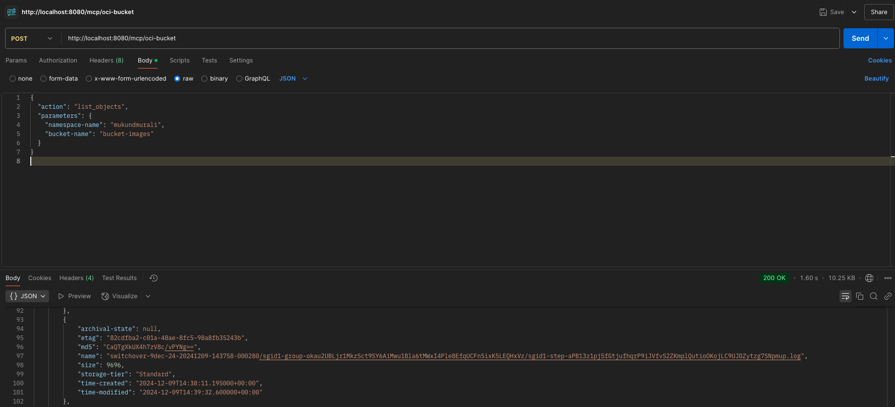

# 🧠 MCP Data Interface for OCI Object Storage

This project is a **Model Context Protocol (MCP)**-based API interface for **Oracle Cloud Infrastructure (OCI) Object Storage**. It allows AI agents, tools like Ollama, and natural language interfaces to programmatically list and read objects from OCI buckets via structured JSON requests.

---

## 📌 Features

- ✅ List objects in an OCI bucket
- ✅ Read and return file contents from a bucket
- ✅ Minimal and easy-to-extend MCP-style API
- ✅ FastAPI-powered Python server
- ✅ CLI-driven backend using `oci os` commands

---

## 📦 Use Cases

This MCP server is ideal for:

- **AI/LLM agents** needing data from OCI buckets
- **Streamlit or LangChain apps** accessing cloud storage
- **FinOps or Security tools** fetching bucket inventories
- **Conversational UIs** querying cloud resources
- **Cloud-native notebooks** fetching `.csv`, `.json`, etc. for ML

---

## 🧪 Example MCP Requests

### 1. List Objects in a Bucket

```json
{
  "action": "list_objects",
  "parameters": {
    "namespace-name": "your-namespace",
    "bucket-name": "ml-data"
  }
}

```

### 2. Read an Object from a Bucket

```json
{
"action": "read_object",
"parameters": {
"namespace-name": "your-namespace",
"bucket-name": "ml-data",
"name": "iris.csv"
}
}
```

## ⚙️ Setup Instructions

### Prerequisites

- Python 3.8+
- [OCI CLI](https://docs.oracle.com/en-us/iaas/Content/API/SDKDocs/cliinstall.htm) installed and configured
- `~/.oci/config` file with your credentials

### Install Dependencies

```bash
pip install fastapi uvicorn pydantic
```

### 🐍 OSS-Server.py

```python
from argparse import Action
from typing import Required
from fastapi import FastAPI, HTTPException
from pydantic import BaseModel
import subprocess
import json
import os
import tempfile

app = FastAPI(title="OCI Object Storage Server", version="0.1.0")

class MCPRequest(BaseModel):
    action: str
    parameters: dict

@app.post("/mcp/oci-bucket")
def handle_mcp_request(req: MCPRequest):
    try: 
        if req.action == "list_objects":
            return list_objects(req.parameters)
        elif req.action == "read_object"    :
            return read_object(req.parameters)
        else:
            return HTTPException(status_code=400, detail="Invalid action")
    except Exception as e:
        return HTTPException(status_code=500, detail=str(e))
        
def list_objects(params: dict):
    Required = ["namespace-name", "bucket-name"]
    for key in Required:
        if key not in params:
            return HTTPException(status_code=400, detail=f"Missing required parameter: {key}")
        
    cmd = ["oci", "os", "object", "list", "--namespace-name", params["namespace-name"], "--bucket-name", params["bucket-name"], "--output", "json"]
    result = subprocess.run(cmd, stdout=subprocess.PIPE, stderr=subprocess.PIPE, text=True)

    if result.returncode != 0:
        return HTTPException(status_code=500, detail=result.stderr)
    
    return json.loads(result.stdout)

def read_object(params: dict):
    Required = ["namespace-name", "bucket-name", "object-name"]
    for key in Required:
        if key not in params:
            return HTTPException(status_code=400, detail=f"Missing required parameter: {key}")
        
    cmd = ["oci", "os", "object", "get", "--namespace-name", params["namespace-name"], "--bucket-name", params["bucket-name"], "--object-name", params["object-name"], "--output", "json"]
    result = subprocess.run(cmd, stdout=subprocess.PIPE, stderr=subprocess.PIPE, text=True)

    if result.returncode != 0:
        return HTTPException(status_code=500, detail=result.stderr)
    
    return json.loads(result.stdout)
    
            
```

### Run the MCP server

```python
uvicorn OSS-server:app --reload --port 8080
```
---

### Test it locally



### Security Notes

This is a minimal dev-focused implementation.
Not secured for public access — add authentication if exposing over a network.
Optionally use API keys, allow-listed actions, logging, etc.

### 🧠 Inspiration

This project is part of a broader initiative to make cloud resources AI-native by enabling structured, model-friendly access protocols to OCI resources.

### Inspired by:

- Ollama + Streamlit-based DevTools
- LangChain agent integrations
- OCI automation for GenAI and Data Science

### 🔗 Related Projects

- [OCI CLI Docs](https://docs.oracle.com/en-us/iaas/Content/API/SDKDocs/cliinstall.htm)
- [FastAPI](https://fastapi.tiangolo.com/)
- [LangChain](https://github.com/hwchase17/LangChain)
- [Ollama](https://ollama.com/)

