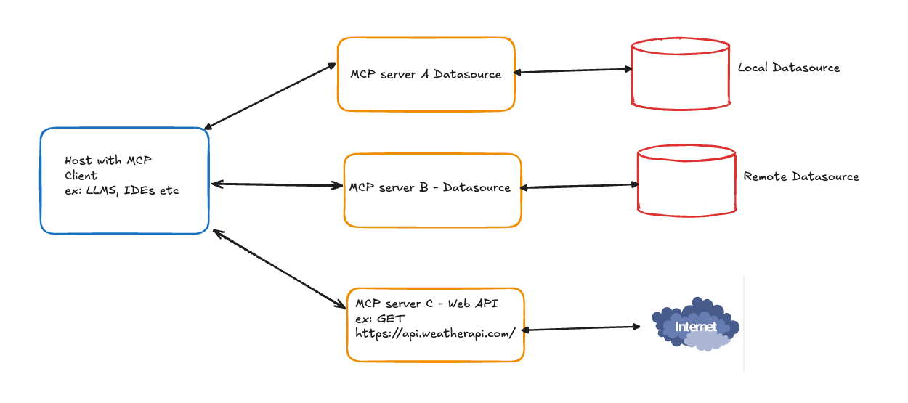

# MCP

# What is MCP ?

Model context protocol (MCP) 

- It is a protocol that allows LLMs to access custom tools and services.
- If your LLM wants to talk to an agent for a specific task then with MCP it is easy to integrate the LLM to this Agent.

# Why MCP is needed ?

MCP helps you build agents and complex workflows on top of LLMs. LLMs frequently need to integrate with data and tools, and MCP provides:

- A growing list of pre-built integrations that your LLM can directly plug into
- The flexibility to switch between LLM providers and vendors
- Best practices for securing your data within your infrastructure

# General Architecture

<aside>
📖

> At its core, MCP follows a client-server architecture where a host application can connect to multiple servers
> 
</aside>

- **MCP Hosts**: Programs like Claude Desktop, IDEs, or AI tools that want to access data through MCP
- **MCP Clients**: Protocol clients that maintain 1:1 connections with servers
- **MCP Servers**: Lightweight programs that each expose specific capabilities through the standardized Model Context Protocol
- **Local Data Sources**: Your computer’s files, databases, and services that MCP servers can securely access
- **Remote Services**: External systems available over the internet (e.g., through APIs) that MCP servers can connect to